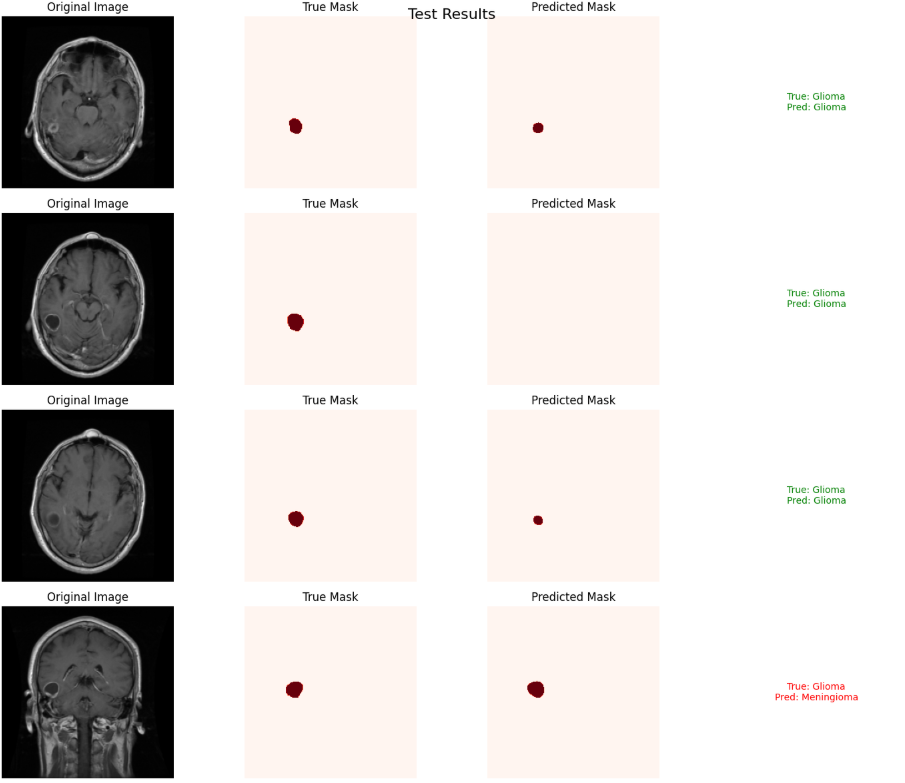
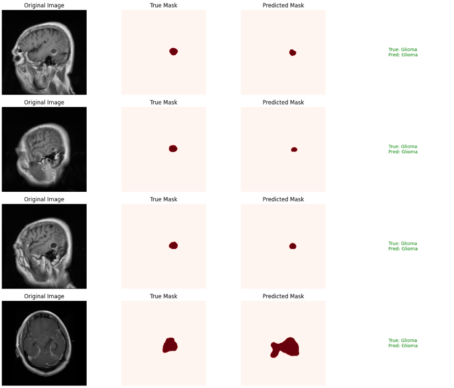
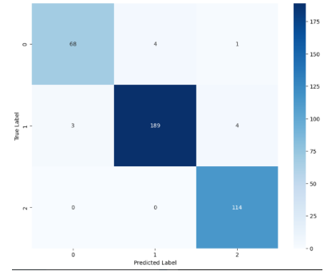
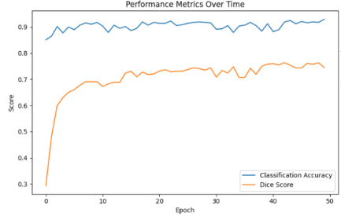
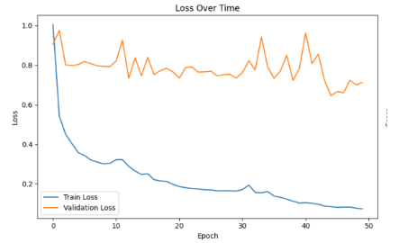

# Brain Tumor Segmentation and Classification
---

## Introduction
---

This project presents a deep learning pipeline for automated brain tumor detection and classification, integrating both segmentation and classification tasks to enhance tumor analysis. A U-Net architecture is employed to segment tumor regions from T1-weighted MRI scans by producing binary masks that localize tumor areas. For classification, a fine-tuned ResNet-50 model categorizes the detected tumors into three classes: meningioma, glioma, and pituitary. The models were trained and evaluated on a publicly available dataset annotated for both segmentation and classification, ensuring consistency and reliability in performance assessment.

## Dataset

We used a publicly available dataset of brain MRI scans, containing a total of 3,064 samples. Each sample includes a patient ID, the MRI image itself, the type of tumor, a segmentation mask, and the tumor’s boundary.

To ensure fair evaluation, the dataset was split into training, validation, and test sets, with no patient overlap across splits. This is important because some patients appear multiple times with different MRI scans. By avoiding patient duplication, we prevent data leakage and ensure that model performance reflects true generalization.

**Dataset download link**: [Brain Tumor Dataset - Papers with Code](https://paperswithcode.com/dataset/brain-tumor-dataset)

**Distribution of Tumor Types in Dataset**

| Tumor Type | Num of Samples | Percentage |
|------------|----------------|------------|
| Meningioma | 708            | 23.1%      |
| Glioma     | 1,426          | 46.5%      |
| Pituitary  | 930            | 30.4%      |

### Results
---

  
  

### Evaluation Metrics (on Test Set)
---

- **Dice Score (Segmentation)**: 0.7495  
- **Accuracy (Classification)**: 96%
  

  
   
  
   
  
   

### Acknowledgments
---

 
  <b>Farouk K.</b> 
  <b>Mohamed J.</b> 
  <b>Brian Y.</b> 
  <b>Jose J.</b>

         

